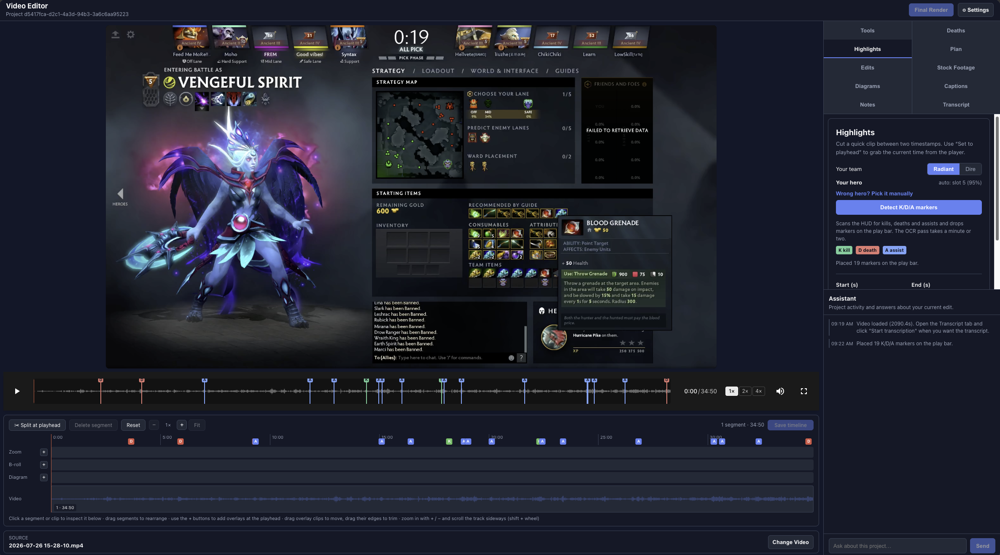

# Video Editor

A simple video editing tool with a FastAPI backend for automated podcast video editing.



## Features

- **Transcript Extraction**: Extract transcripts from videos using Whisper AI
- **Filler Word Removal**: Automatically detect and remove filler words (um, ah, uh, etc.)
- **AI Editing Plans**: Generate intelligent editing suggestions using an LLM
- **Stock Footage Integration**: Download stock footage from Pexels API
- **Caption Removal**: Erase burned-in subtitles/captions via AI inpainting (see below)
- **REST API**: FastAPI-based backend ready for frontend integration

## Quick Start

### 1. Install Dependencies

```bash
uv pip install -e .
```

### 2. Set Up Environment Variables

Create a `.env` file (kept out of git) with your API keys:
```
API_KEY=your_llm_api_key_here          # editing-plan generation
PEXELS_API_KEY=your_pexels_api_key_here # stock footage download
```
For the caption-removal feature, see [Caption Removal](#caption-removal-burned-in-subtitles)
for its additional `SUBTITLE_REMOVER_*` variables.

### 3. Start the Backend Server

```bash
python run_server.py
```

Or using uvicorn directly:
```bash
uvicorn backend.app:app --reload --host 0.0.0.0 --port 8000
```

The API will be available at `http://localhost:8000`

Visit `http://localhost:8000/docs` for interactive API documentation.

## Caption Removal (burned-in subtitles)

This feature removes hard-coded captions/subtitles baked into the video pixels. It shells out
to the third-party [VideoSubtitleRemover](https://github.com/SysAdminDoc/VideoSubtitleRemover)
CLI as an **isolated subprocess** (it ships its own package named `backend` and heavy GPU
deps, so it is cloned into `third_party/` with its own virtualenv rather than imported).

The backend reads three env vars:

| Variable | Purpose | Default |
|----------|---------|---------|
| `SUBTITLE_REMOVER_DIR` | Path to the cloned repo | `third_party/VideoSubtitleRemover` |
| `SUBTITLE_REMOVER_PYTHON` | Python interpreter of the tool's venv | `<dir>/.venv/bin/python` |
| `SUBTITLE_REMOVER_USE_GPU` | `1`/`true` to run inpainting on an NVIDIA GPU | `0` (CPU) |

If the directory/interpreter is missing, the feature's endpoints return an error rather than
crashing the server.

### macOS / CPU setup

```bash
git clone https://github.com/SysAdminDoc/VideoSubtitleRemover third_party/VideoSubtitleRemover
cd third_party/VideoSubtitleRemover
python -m venv .venv && .venv/bin/pip install -r requirements.txt
# Sanity check (CPU-only):
.venv/bin/python -m backend.processor -i sample.mp4 -o out.mp4 -m sttn --gpu -1
```

> macOS has no NVIDIA CUDA, so the tool runs the slow CPU inpainting path. The repo's
> `paddlepaddle-gpu` / `onnxruntime-directml` deps are NVIDIA/Windows-only; install the CPU
> subset and leave `SUBTITLE_REMOVER_USE_GPU=0`.

### Windows + NVIDIA GPU setup (e.g. RTX 5060)

The RTX 5060 is a **Blackwell (RTX 50-series)** card. Blackwell needs **CUDA 12.8+** and
PyTorch wheels built for it (the `cu128` index), so the generic `pip install torch` (CPU/older
CUDA) will *not* use the GPU. Steps (run in **PowerShell**):

**1. Drivers & toolchain**
- Install the latest NVIDIA **Game Ready / Studio driver** (Blackwell-capable). Verify:
  ```powershell
  nvidia-smi      # should list your RTX 5060 and a CUDA version >= 12.8
  ```
- Install **Python 3.12 (64-bit)** from python.org (the tool recommends 3.12–3.13 for CUDA).
- Install **Git** and **FFmpeg**, and ensure `ffmpeg` is on your `PATH` (`ffmpeg -version`).

**2. Clone the tool and create its venv**
```powershell
git clone https://github.com/SysAdminDoc/VideoSubtitleRemover third_party\VideoSubtitleRemover
cd third_party\VideoSubtitleRemover
py -3.12 -m venv .venv
.\.venv\Scripts\activate
python -m pip install --upgrade pip
```

**3. Install GPU-enabled PyTorch first (Blackwell needs the cu128 wheels)**
```powershell
pip install torch torchvision --index-url https://download.pytorch.org/whl/cu128
```
Confirm the GPU is visible to PyTorch before continuing:
```powershell
python -c "import torch; print(torch.__version__, torch.cuda.is_available(), torch.cuda.get_device_name(0))"
# Expect: True and 'NVIDIA GeForce RTX 5060'
```

**4. Install the GPU OCR runtime and the rest of the requirements**
```powershell
pip install onnxruntime-gpu          # CUDA execution provider for the OCR stage
pip install -r requirements.txt      # OCR engines, inpainting models, etc.
```
> Note on PaddlePaddle: `paddlepaddle-gpu` may not yet ship Blackwell (sm_120) kernels. If it
> fails to install or errors at runtime, you can skip it — the tool falls back to RapidOCR
> (ONNX) / EasyOCR for caption detection, both of which use `onnxruntime-gpu` / PyTorch on the
> GPU. Install only the CPU `paddlepaddle` if you want Paddle available, or omit it entirely.

**5. Verify GPU inpainting works (note `--gpu 0`, not `-1`)**
```powershell
python -m backend.processor -i sample.mp4 -o out.mp4 -m sttn --gpu 0
```
Watch `nvidia-smi` during the run — you should see the python process using GPU memory.

**6. Point the app at the venv and enable GPU**

In the repo-root `.env` (Windows paths — forward slashes are fine for the interpreter, but it
must be the `Scripts` interpreter):
```
SUBTITLE_REMOVER_DIR=third_party/VideoSubtitleRemover
SUBTITLE_REMOVER_PYTHON=third_party/VideoSubtitleRemover/.venv/Scripts/python.exe
SUBTITLE_REMOVER_USE_GPU=1
```
Restart the backend. The "Remove Captions" button now runs on the GPU. You can also override
per request via `POST /api/video/remove-captions/{file_id}?use_gpu=true` (or `false`), and pick
a higher-quality but slower inpainting model with `?mode=lama` / `?mode=propainter`.

## API Documentation

See [backend/README.md](backend/README.md) for detailed API documentation and usage examples.

## Project Structure

```
.
├── backend/               # Backend API code
│   ├── app.py            # FastAPI application
│   ├── features/         # Feature modules
│   ├── utils/            # Utility functions
│   ├── tests/            # Tests
│   └── examples/         # Example scripts
├── run_server.py         # Server startup script
└── pyproject.toml        # Project dependencies
```

## CLI Usage (Legacy)

The original CLI interface is still available in `backend/main.py`:

```bash
python backend/main.py /path/to/video.mp4 --model_size base
```
